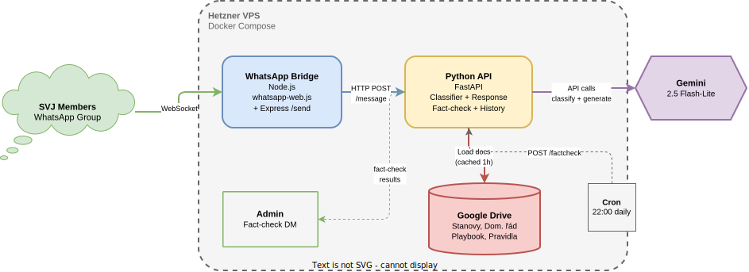

# SVJ Bot — WhatsApp Chatbot for Homeowners Associations

A WhatsApp chatbot for Czech HOAs (SVJ — Společenství vlastníků jednotek) that answers member questions based on internal documents (bylaws, house rules, playbook). Works in both direct messages and group chats.

## Why whatsapp-web.js instead of the official API?

We initially built this bot using the **WhatsApp Business API** (Meta Cloud API). It worked well for direct messages, but we discovered a critical limitation:

**WhatsApp Business API does not support group chats.** Business API numbers cannot be added to groups — this is a hard limitation from Meta, not a configuration issue.

Since the primary use case is answering questions inside an existing HOA WhatsApp group, we switched to **whatsapp-web.js** — an unofficial library that connects to WhatsApp Web. This allows the bot to:
- Be a member of WhatsApp groups
- Read and respond to group messages
- Work exactly like a regular WhatsApp user

**Trade-off:** Using an unofficial library technically violates WhatsApp's Terms of Service. The realistic risk of a ban is low for a small community bot (5–20 messages/day, no spam, no unsolicited messages), but it exists. If banned, the solution is a new prepaid SIM (~100 CZK).

## Architecture



Two services run on a single VPS via Docker Compose:
- **whatsapp-bridge** (Node.js) — maintains a persistent WhatsApp Web session, receives messages, sends replies
- **python-api** (Python/FastAPI) — handles LLM logic, knowledge base, relevance classification

The Node.js bridge forwards messages to the Python API over localhost. The Python API decides whether to respond (for group messages) and generates answers using Gemini.

## Components

| File | Description |
|------|-------------|
| `main.py` | FastAPI app, `/message` endpoint, admin commands |
| `llm.py` | Gemini LLM integration + relevance classifier for group messages |
| `knowledge_base.py` | System prompt builder from loaded documents |
| `drive_loader.py` | PDF and DOCX document loader from Google Drive |
| `secret_manager.py` | Secret retrieval (env vars, with GCP Secret Manager fallback) |
| `Dockerfile` | Python service container |
| `docker-compose.yml` | Orchestrates both services |
| `whatsapp-bridge/index.js` | WhatsApp Web client (Node.js) |
| `whatsapp-bridge/Dockerfile` | Node.js + Chromium container |

## Features

- **Czech language** — responds in Czech, handles Czech input natively
- **Group chat support** — intelligently decides when to respond in group conversations using an LLM classifier
- **Knowledge-based answers** — answers only from uploaded documents
- **Conversation context** — remembers last 5 messages per chat for follow-up questions (e.g., "a co o víkendech?" after asking about noise rules)
- **Smart silence** — in groups, the bot stays silent when it doesn't have a useful answer instead of saying "I don't know"
- **Daily fact-check** — collects all group messages and runs a nightly fact-check against SVJ documents; sends findings to admin via DM
- **Finance topic blocking** — refuses to answer questions about fees, payments, budgets — redirects to the committee
- **Prompt injection protection** — refuses to reveal instructions, settings, or document names
- **Rate limiting** — DMs limited to 10 messages/hour per sender to prevent abuse
- **Admin commands** — `!reload` to refresh knowledge base, `!factcheck` to trigger manual fact-check (admin-only)
- **Auto-reload** — documents refresh from Google Drive every hour
- **Group whitelist** — bot only operates in explicitly allowed groups; silently ignores messages from unauthorized groups
- **Human-like behavior** — typing indicators, read receipts (`sendSeen`), variable response delays, presence signaling — reduces WhatsApp detection risk
- **Quiet hours** — bot does not respond in groups between 23:00–06:00 CET
- **Exponential backoff reconnect** — on disconnect, retries with increasing delays (60s→1800s), max 5 attempts before exiting for Docker restart
- **Persistent group whitelist** — allowed groups stored in JSON file on Docker volume; `!allowgroup` admin command adds groups at runtime
- **Session persistence** — WhatsApp session survives container restarts via Docker volume
- **Proactive messaging** — bridge exposes `/send` endpoint for bot-initiated DMs (used by fact-check)
- **Sender blocklist** — specific phone numbers can be blocked from triggering any bot response
- **Dozzle** — lightweight Docker log viewer accessible via SSH tunnel (port 9090)

## Group message filtering

The bot uses a two-step approach for group messages:

1. **Relevance check** — a fast LLM call classifies whether the message is HOA-related (rules, complaints, procedures, contacts) or casual chat (greetings, jokes, personal topics). The classifier also receives recent conversation history so follow-up questions are correctly recognized.
2. **Response generation** — only if the message is relevant, the bot generates a full answer using the knowledge base
3. **Value filter** — if the generated response indicates the bot doesn't know the answer, it stays silent in groups instead of posting unhelpful replies

This prevents the bot from responding to every message in the group.

## Daily fact-check

The bot silently logs all group messages throughout the day. At 22:00 (via cron), it sends the full day's conversation along with SVJ documents to the LLM for fact-checking. If any member stated something factually incorrect about SVJ rules, the admin receives a DM with the findings. If everything is correct, a simple ✅ confirmation is sent.

This can also be triggered manually with `!factcheck`.

## Setup

### Prerequisites
- A VPS (e.g., Hetzner CX11/CX22, ~3–5 EUR/month)
- Google account with Gemini API access
- A phone number with WhatsApp installed (for QR code scanning)
- Docker and Docker Compose on the VPS

### 1. Google Cloud (for Gemini API + Drive)
```bash
# Create project and enable APIs
gcloud projects create svj-bot
gcloud config set project svj-bot
gcloud services enable drive.googleapis.com generativelanguage.googleapis.com
```

### 2. Google Drive
1. Create a folder (e.g., `BOT_KNOWLEDGE`)
2. Upload your documents (PDF, DOCX, or Google Docs)
3. Create a service account, download its JSON key
4. Share the folder with the service account email (Viewer access)

### 3. Configure
Create a `.env` file on the VPS:
```bash
GEMINI_API_KEY=your_gemini_api_key
GOOGLE_DRIVE_FOLDER_ID=your_drive_folder_id
GOOGLE_SERVICE_ACCOUNT_JSON=service-account.json
BUILDING_NAME=Your SVJ Name
ADMIN_PHONE=420123456789
```

Place `service-account.json` in the project root.

### 4. Deploy
```bash
# On the VPS
cd /opt/svj-bot
docker compose build

# First time — scan QR code
docker compose up whatsapp-bridge
# → QR code appears in terminal
# → Scan with WhatsApp on the bot's phone
# → Ctrl+C after "WhatsApp Web client is ready!"

# Run in background
docker compose up -d
```

### 5. Add bot to group
Add the bot's phone number to your WhatsApp group as a regular participant.

## Operations

### Admin commands (via WhatsApp, admin number only)
- `!reload` — immediately reload documents from Google Drive
- `!factcheck` — run fact-check on today's group messages and receive results via DM
- `!allowgroup` — (send in a group) permanently adds that group to the whitelist

### Update documents
1. Edit/add files in the **BOT_KNOWLEDGE** folder on Google Drive
2. Supported formats: **PDF**, **DOCX**, **Google Docs**
3. Send `!reload` via WhatsApp, or wait up to 1 hour for auto-reload

### Check logs

**Terminal:**
```bash
ssh root@YOUR_VPS_IP "cd /opt/svj-bot && docker compose logs -f --tail=50"
```

**Dozzle (web UI):**
```bash
ssh -L 9090:localhost:9090 root@YOUR_VPS_IP
# Then open http://localhost:9090 in your browser
```

### Restart services
```bash
ssh root@YOUR_VPS_IP "cd /opt/svj-bot && docker compose restart"
```

### Re-scan QR code (if session expires)
```bash
ssh root@YOUR_VPS_IP "cd /opt/svj-bot && docker compose down whatsapp-bridge && docker volume rm svj-bot_whatsapp_session && docker compose up whatsapp-bridge"
# Scan QR, then Ctrl+C and docker compose up -d
```

## Environment Variables

| Variable | Description |
|----------|-------------|
| `GEMINI_API_KEY` | Gemini LLM API key |
| `GOOGLE_DRIVE_FOLDER_ID` | Google Drive folder ID with documents |
| `GOOGLE_SERVICE_ACCOUNT_JSON` | Path to service account JSON key file |
| `BUILDING_NAME` | SVJ name for the system prompt |
| `ADMIN_PHONE` | Admin phone number without + (e.g., `420720994342`) |
| `PYTHON_API_URL` | Python API URL (set in docker-compose.yml, default: `http://python-api:8080`) |
| `BRIDGE_URL` | WhatsApp bridge URL for proactive messaging (default: `http://whatsapp-bridge:3000`) |
| `BRIDGE_PORT` | Port for the bridge HTTP server (default: `3000`) |
| `ALLOWED_GROUP_IDS` | Comma-separated whitelist of WhatsApp group JIDs (e.g., `120363406060112788@g.us`). Bot ignores messages from unlisted groups. Also merged with persistent whitelist on disk. |

## Security

- **Secrets** — stored in `.env` file on VPS, not in code or Docker images
- **Prompt injection** — system prompt is hardened against manipulation attempts
- **Document names** — never revealed; bot references documents generically ("as per the bylaws")
- **Admin commands** — restricted to admin phone number only
- **Group messages** — bot only responds to relevant HOA questions, ignores casual chat
- **Rate limiting** — DMs capped at 10/hour per sender to prevent cost abuse
- **fail2ban** — SSH brute-force protection enabled on VPS
- **SSH hardened** — password authentication disabled, key-only access
- **Group whitelist** — bot only responds in allowed groups; silently ignores unauthorized groups
- **No exposed ports** — only SSH (22) is publicly accessible; API and bridge are localhost/Docker-internal only
- **Finance blocking** — bot refuses to answer financial questions to prevent misinformation

## Cost Estimate

Estimated monthly cost at typical usage (5–20 messages/day):

| Service | Cost |
|---------|------|
| Hetzner VPS (CX22) | ~4.35 EUR (~110 CZK) |
| Gemini API | ~$0.05–0.10 |
| Google Drive API | $0.00 |
| **Total** | **~4.50 EUR/month (~115 CZK)** |

## Migration history

1. **v1 (Cloud Run + WhatsApp Business API)** — worked for DMs but Business API cannot join groups
2. **v2 (Hetzner VPS + whatsapp-web.js)** — unofficial library enables group chat support at the cost of ToS compliance

## License

MIT — see [LICENSE](LICENSE).
